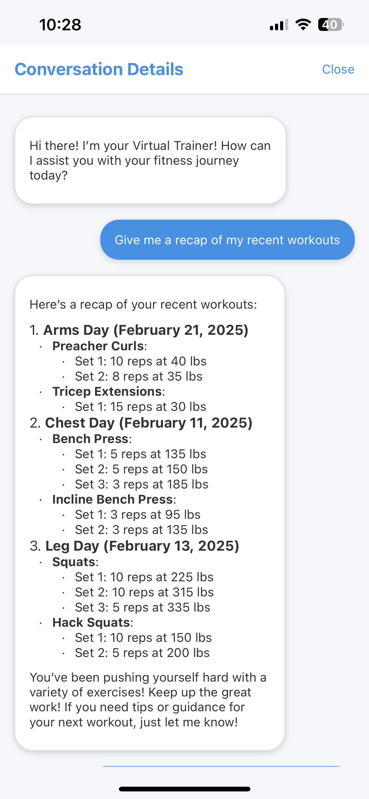

# Workout Assistant

Workout Assistant is a mobile application designed to help users track their workouts, log exercises, and receive AI-powered workout suggestions based on their previous sessions.

## Features
- **Workout Logging:** Users can input their exercises, sets, reps, and weights.
- **AI Personal Trainer:** The app provides workout suggestions based on past performance.
- **AsyncStorage Integration:** Workout data is stored locally for quick access.
- **User-Friendly Interface:** Simple and intuitive design for easy workout tracking.

## Usage
- Open the app and log your workout details.
- View past workouts and track progress.
- Receive AI-powered workout recommendations based on your logged data.

## Technologies Used
- **React Native** for the mobile UI
- **AsyncStorage** for local data storage
- **Node.js** for backend functionalities
- **OpenAI Model** for personalized workout recommendations

## Future Improvements
- Cloud sync for cross-device workout tracking
- Enhanced AI model for better workout suggestions
- UI/UX improvements for a seamless user experience

 
  

## License
This project is licensed under the MIT License.

---
**Author:** Bryce Martin  
GitHub: [brycemartin04](https://github.com/brycemartin04)

